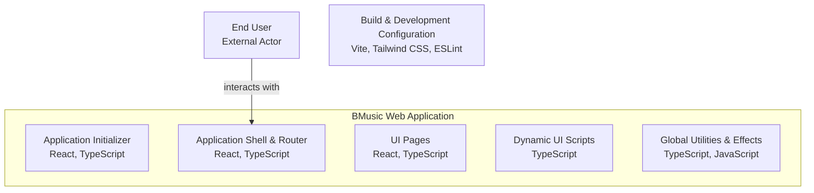

# BlackMusic Official Website
Centric Site

# Code Visualazation

```mermaid
graph TD

    765["End User<br>External Actor"]
    771["Build &amp; Development Configuration<br>Vite, Tailwind CSS, ESLint"]
    subgraph 764["BMusic Web Application"]
        766["Application Initializer<br>React, TypeScript"]
        767["Application Shell &amp; Router<br>React, TypeScript"]
        768["UI Pages<br>React, TypeScript"]
        769["Dynamic UI Scripts<br>TypeScript"]
        770["Global Utilities &amp; Effects<br>TypeScript, JavaScript"]
    end
    %% Edges at this level (grouped by source)
    765["End User<br>External Actor"] -->|interacts with| 767["Application Shell &amp; Router<br>React, TypeScript"]
```

