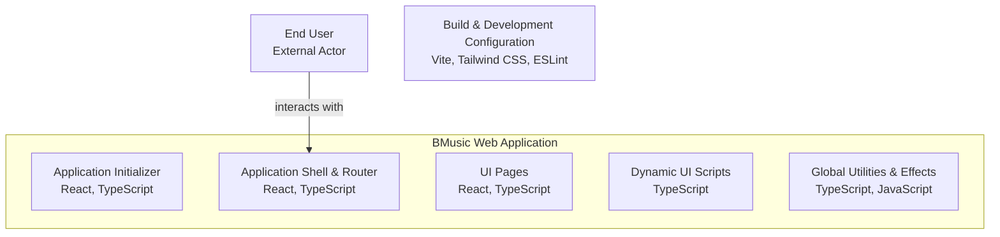

# BlackMusic Centric Official Website

The **[BlackMusic](https://github.com/BlackBlazent/BlackMusic) official website** is the official digital hub for the BlackMusic platform — a comprehensive ecosystem designed to support users, extension developers, and partners. It serves as the gateway to essential resources including documentation, extension publishing, downloads, and community engagement.

This website plays a critical role in enabling interaction between the core application, its growing developer community, and end users who rely on BlackMusic for an enriched audio experience.

## Code Visual

## Licensing

All content and source code in this repository are the intellectual property of **BlackMusic**. Redistribution or commercial use without prior consent is prohibited.

## Contact

For business inquiries, support, or development questions, please contact:

* **Email:** [support@blackmusic.app](mailto:support@blackmusic.app)
* **Website:** [https://blackmusic.app](https://blackmusic.app)

